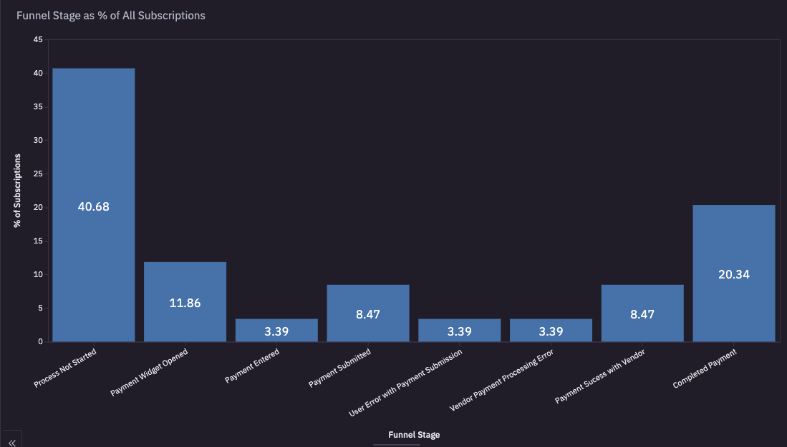

# Fintech SaaS Payment Funnel Analysis

## Executive Summary

There is a large number of subscriptions that haven't been converted into revenue. This analysis looks at the payment funnel at the subscription level starting from opting into the subscription through completed payment. There is significant abondonment after the payment widget is opened or when the user enounters friction in the form of an error. Secondly, 40% of opted into subscriptions haven't attempted to start the payment process. I recommend to consider optimizing the checkout flow to reduce user friction and error, retarget customers with reminders that have unpaid subscrptions, and lastly explore the possibility of adding redundancy by adding a second payment processor. 

## Business Problem

The finance team has discovered that there are numerous subscriptions that haven't been paid for representing unconverted subscriptions. They have reached out to the product team to better understand the process starting from opting into a subscription to completing the payment for the subscription. The finance team has specifically asked if there are any common friction points within the process that could be improved.

## Methods & Skills Used
- Exploratory Data Analysis
- Joins / Anti Join
- Aggregate Functions
- CTEs
- Subqueries
- Case Statements

## Results 

After conducting the analysis there is  significant room for opportunity as only 20.34% of all subscriptions are converted into revenue or paid. An equally alarming item is the percentage of subscriptions that haven't attempted to pay as we know those subscriptions haven't opened the payment portal. To counter this there is an attached file with the customer IDs, names, phone numbers, and list of subscriptions that are yet to be paid for each customer. This can be used to develop an outreach campaign to convert subscriptions into revenue.

Looking at the payment funnel there is additional improvement that can be made. Specifically in the steps between the widget being opened and the user successfully submitting payment to the third party processor. Users are experiencing friction entering their payment information and submitting it correctly the first attempt. 

## Recommendations

1. Initiate an outreach campaign to retarget and remind the customers who haven't attempted to pay for their subscription.

Develop and execute a targeted campaign to retarget customers who have not attempted to pay for their subscriptions. This could include email reminders, SMS notifications, and personalized calls to action to prompt users to complete the payment process.

2. Optimize the checkout flow

Exploring integrating more seamless or embedded way for users to enter their credit card information such as Apple Pay or Google Pay. Additionally, if not already done reduce the number of pages the user needs to click through from start to finish.
   
3. Explore routing payment information to a second processor ad hoc.

If one payment processor fails to process the transaction due to vendor error. Routing the payment information to a backup processor could keep the user from being forced to try entering their payment information a second time.
